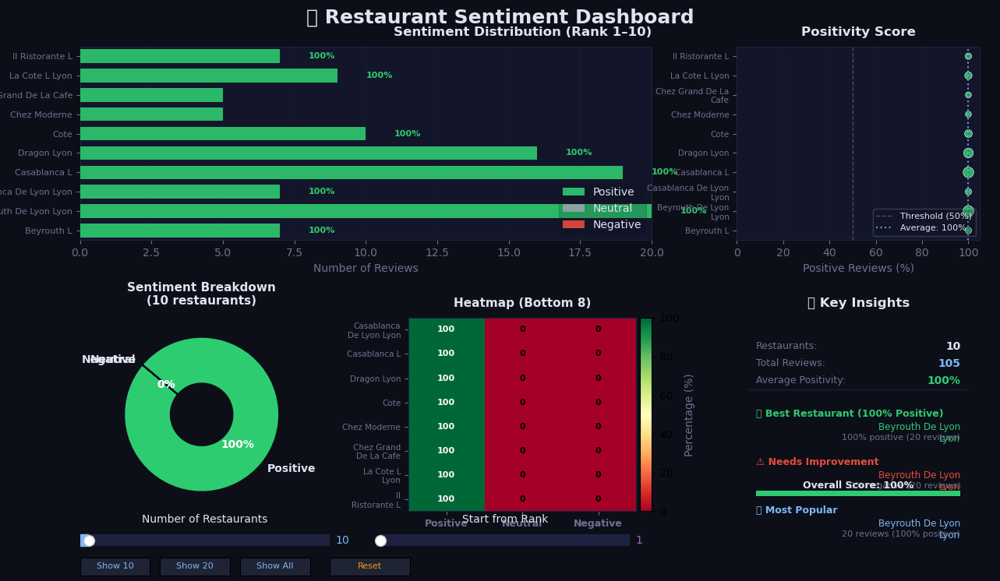
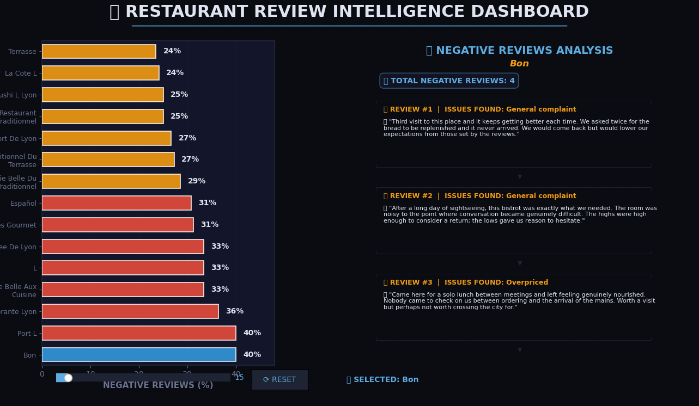
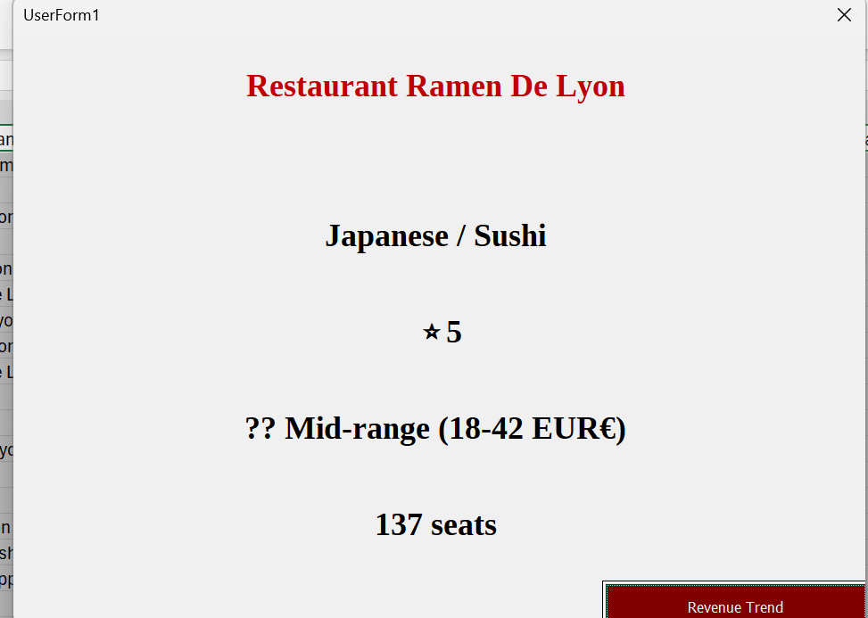
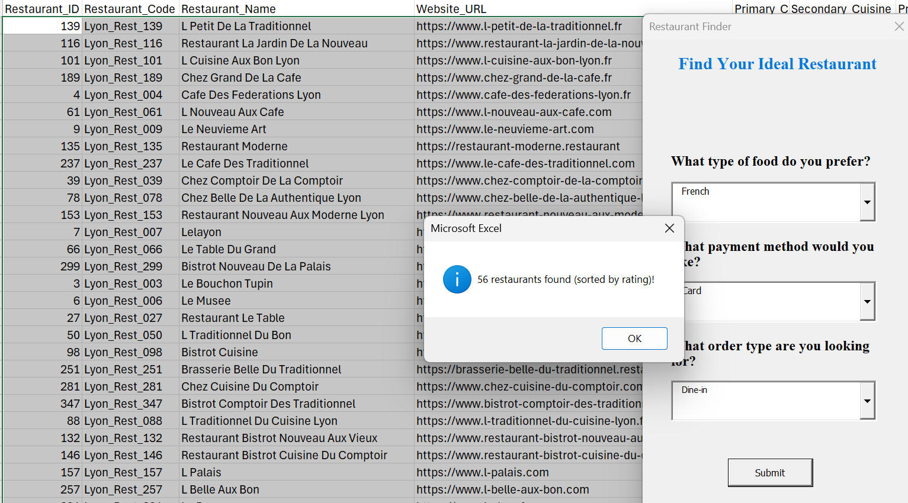
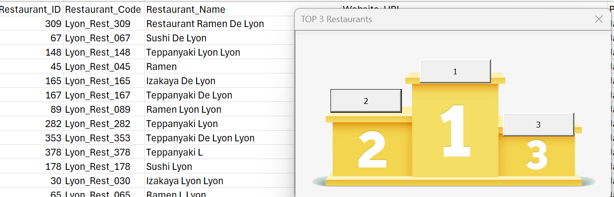
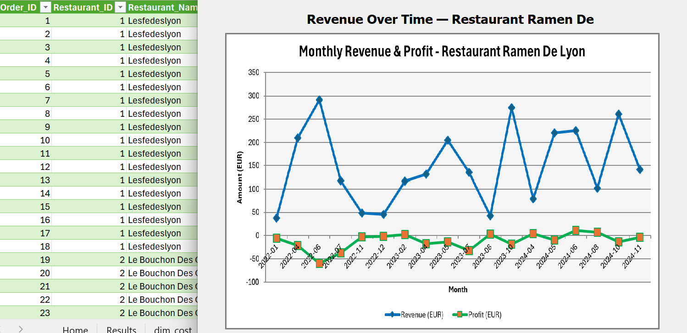

# 🍽️ Lyon Restaurant Intelligence — End-to-End Data Science Project

> A complete data science pipeline covering ETL, OLAP modelling, descriptive analytics, textual analysis, predictive machine learning, and an interactive VBA application — built on the restaurant ecosystem of Lyon, France.

---

## 📸 Project Previews

| Dashboard | Description |
|-----------|-------------|
|  | Restaurant Sentiment Dashboard |
|  | Negative Review Intelligence |
|  | Monthly Revenue & Profit Chart |
|  | VBA Customer Decision Tool |
|  | Top 3 Restaurant Ranking |
|  | Restaurant Profile Popup |
|  | Numerical Variables |
|  | Categorical Variables |
|  | Correlation Analysis |
|  | Model Results |
|  | Test Data Results |


---

## 📋 Table of Contents

- [Project Overview](#project-overview)
- [Data Sources](#data-sources)
- [ETL Pipeline](#etl-pipeline)
- [Data Models](#data-models)
- [Analytics](#analytics)
- [Textual Analysis](#textual-analysis)
- [Predictive Analytics](#predictive-analytics)
- [VBA Application](#vba-application)
- [Results](#results)
- [Tech Stack](#tech-stack)
- [How to Run](#how-to-run)
- [Repository Structure](#repository-structure)

---

## 🧭 Project Overview

This project builds a full intelligence pipeline for Lyon's restaurant industry, starting from raw data collection and ending in a working interactive tool for customers and restaurant owners. It was designed to demonstrate how every stage of the data science workflow connects — from engineering to insight to prediction to product.

---

## 📦 Data Sources

- **Kaggle** — Public restaurant and review datasets
- **Google Places API** — Location, rating, and category data for Lyon restaurants
- **API Wrappers** — Custom wrappers built to pull and standardise data from multiple endpoints

All sources were merged and cleaned through a structured ETL pipeline before being loaded into the data warehouse model.

---

## ⚙️ ETL Pipeline

The Extract-Transform-Load process covered:

1. **Extract** — Pulled data from Kaggle CSVs, Google API JSON responses, and supplementary public sources
2. **Transform** — Cleaned missing values, standardised column types, encoded categoricals, derived new features (age, ratio columns, sentiment flags)
3. **Load** — Loaded into a structured Excel workbook with separate dimension and fact sheets, ready for OLAP analysis

---

## 🗄️ Data Models

### Entity-Relationship Diagram
A full ER diagram was designed capturing relationships between restaurants, customers, orders, dishes, reviews, and cost structures.

### OLAP Star Schema Models (×3)

| Model | Purpose |
|-------|---------|
| **OLAP 1 — Financial** | Analyses revenue, profit, and costs across restaurants, time, and price categories |
| **OLAP 2 — Orders** | Analyses order volume, dish categories, order channels, and payment methods |
| **OLAP 3 — Reviews** | Analyses ratings, sentiment labels, review frequency, and keyword trends |

Each model follows a star schema with a central fact table and surrounding dimension tables (Dim_Restaurant, Dim_Date, Dim_Customer, Dim_Dish, Dim_Review, Dim_Operations, Dim_Cost, Dim_Sentiment).

---

## 📊 Analytics

### Descriptive Analytics
- Revenue and profit distribution by restaurant, cuisine, and price category
- Customer segmentation by age group, income level, visit frequency, and type
- Seasonal revenue trends across 2022–2024
- Hygiene score, wait time, and table occupancy comparisons
- Correlation heatmaps across all 86 variables

### Key Insights
- Average transaction revenue: **€144.52**
- Average profit per transaction: **−€10.68** (most transactions are slightly loss-making due to high rent and labour costs)
- Best performing segment: Premium / Upscale restaurants with high tourist ratios
- Most impactful revenue drivers: dish price, order quantity, table occupancy rate

### Prognosis
A dedicated monthly revenue and profit prognosis was built for **one focal restaurant (Leban Lyon)**, projecting forward based on historical trends and seasonal coefficients.

---

## 📝 Textual Analysis

Customer reviews were analysed using:

- **Orange (Data Mining Tool)** — Topic modelling, word clouds, and term frequency analysis
- **Tropes** — Discourse and semantic structure analysis of review corpora

Key outputs:
- Positive keyword clusters (e.g. *ambiance*, *service*, *authentic*)
- Negative keyword clusters (e.g. *overpriced*, *slow*, *noisy*)
- Sentiment classification: Very Positive / Positive / Neutral / Negative / Very Negative
- Sentiment dashboard showing restaurant-level positivity scores and review breakdowns

---

## 🤖 Predictive Analytics

### Target Variable
`Total_Revenue_EUR` (monthly aggregated) — predicting monthly restaurant revenue.

### Models Trained

| Model | R² | RMSE |
|-------|----|------|
| Linear Regression | baseline | — |
| Random Forest Regressor | improved | — |
| **Gradient Boosting Regressor** | **0.95** | **18** |

### Methodology
- **Train/Test Split**: 80% training / 20% testing (`random_state=42`)
- **Features**: 36 features including price category, dish price, order quantity, occupancy rate, social media metrics, hygiene score, and encoded categoricals
- **Scaling**: StandardScaler applied before all models
- **Evaluation**: R², MAE, RMSE, and 5-fold cross-validation
- **Best Model**: Gradient Boosting achieved R² = 0.95 and RMSE = 18 on monthly revenue — near-perfect predictive performance

---

## 💻 VBA Application

An Excel VBA-powered interactive tool was built for two audiences:

### 🧑‍🍳 Restaurant Owner View
- Click any restaurant → popup shows cuisine type, star rating, price range, seating capacity
- "Revenue Trend" button → opens a dynamic monthly Revenue & Profit line chart for that restaurant

### 👤 Customer Decision Tool — Restaurant Finder
Users select:
- Preferred cuisine type (e.g. French, Japanese, Italian)
- Payment method (e.g. Card, Cash)
- Order type (e.g. Dine-in, Takeaway, Delivery)

The tool instantly filters all matching restaurants, sorts by average rating, and displays the top match. A **Top 3 Podium** popup shows the three best options.

### 📊 Sentiment Dashboard (VBA)
- Interactive slider to browse 10–20–All restaurants
- Horizontal bar chart of sentiment distribution per restaurant
- Heatmap of sentiment scores
- Key insights panel: best restaurant, needs improvement, most popular

---

## 🏆 Results

| Metric | Value |
|--------|-------|
| Best Regression R² | **0.95** |
| Best RMSE (monthly) | **18 EUR** |
| Total Restaurants Analysed | 400+ |
| Total Transactions | 8,000 |
| Total Features | 86 |
| Models Compared | 3 regression + 2 classification |
| VBA Tools Built | 4 interactive forms |

---

## 🛠️ Tech Stack

| Tool | Purpose |
|------|---------|
| **Python** | ETL, EDA, machine learning (pandas, sklearn, statsmodels, matplotlib, seaborn) |
| **Excel / VBA** | Interactive dashboards, customer finder, revenue charts |
| **Orange** | Textual mining and sentiment analysis |
| **Tropes** | Discourse analysis of review text |
| **Google Places API** | Restaurant data collection |
| **Kaggle** | Public dataset source |
| **Jupyter Notebook** | Predictive analytics pipeline |

---

## ▶️ How to Run

### Python / Jupyter
```bash
# Clone the repository
git clone https://github.com/YOUR_USERNAME/lyon-restaurant-intelligence.git
cd lyon-restaurant-intelligence

# Install dependencies
pip install pandas numpy matplotlib seaborn scikit-learn statsmodels openpyxl

# Open the notebook
jupyter notebook Predictive.ipynb
```

> Update the `FILE` path in Cell 2 to point to `lyon_restaurants_ETL_final.xlsx` on your machine.  
> If using Google Colab, mount your Drive and update the path accordingly.

### Excel VBA Application
1. Open `projectVBA.xlsm` in Microsoft Excel
2. Enable macros when prompted (required for all interactive features)
3. Navigate using the **Home** sheet buttons
4. Use the **Customer Decision** form to find restaurants
5. Use the **Results** sheet to browse restaurant profiles and revenue trends

---

## 📁 Repository Structure

```
lyon-restaurant-intelligence/
│
├── data/
│   └── lyon_restaurants_ETL_final.xlsx   # Full ETL output with all OLAP sheets
│
├── notebooks/
│   └── Predictive.ipynb                  # Full ML pipeline (regression + classification)
│
├── vba/
│   └── projectVBA.xlsm                   # Interactive Excel VBA application
│
├── images/
│   ├── Restaurant_Sentiment_Dashboard.png
│   ├── Restaurant_Review_Analytics.png
│   ├── Result_Restaurant.png
│   ├── Final_Insights_Owner.png
│   ├── Podium_result.png
│   └── Customer_Decision.png
│
├── README.md
└── LICENSE
```

---

## 📄 License

This project is licensed under the MIT License. See `LICENSE` for details.

---

## 🙋 Author
Abdul Aziz - Clermont School of Business
Built as a full academic and portfolio data science project.  
Feel free to fork, star ⭐, or reach out with questions!
